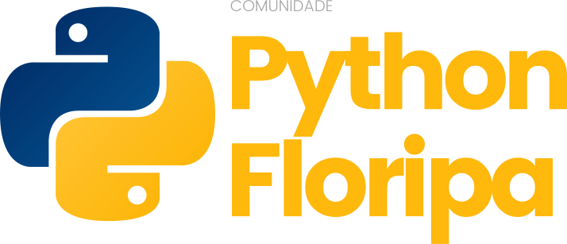

# Site Python Floripa 2021

Repositório do site da comunidade Python Floripa versão 2021!

## Sumário

- [Inicialização](#Inicialização)
    - [Windows](#Windows)
    - [Linux/WSL](#Linux/WSL)
    - [Mac OS](#Mac-OS)
- [Como Contribuir](#Como-Contribuir)
- [Código de Conduta](#Código-de-Conduta)
- [Licença](#Licença)

## Inicialização

Para inicializar o site eu sua máquina pessoal, siga a seção que corresponde ao seu sistema operacional.

### Windows

Contribua escrevendo como rodar nosso site no sistema operacional Windows!

### Linux/WSL

Execute os comandos a seguir no Terminal de sua máquina.

Na raiz do projeto, execute
```
source scripts/inicializacao.sh
```
O script irá criar e ativar um ambiente virtual, instalar as dependências do projeto e iniciar o servidor do site no endereço de hospedagem local (`127.0.0.1`), na porta `8000`.

Ou caso queira executar um comando por vez, na raiz do projeto, execute
```
virtualenv .venv
```
para criar um ambiente virtual chamado `.venv`.

Depois, execute
```
source .venv/bin/activate
```
para ativar o ambiente virtual `.venv`.

Execute
```
pip install -U pip setuptools wheel
```
Para instalar e/ou atualizar as ferramentas **pip**, **setuptools** e **wheel** do Python.

Execute
```
pip install -r requirements.txt
```
Para instalar os requisitos do projeto.

Por fim, na pasta `site_python_floripa`, execute
```
nikola auto
```
Para iniciar o servidor do site no endereço de hospedagem local (`127.0.0.1`), na porta `8000`.

Para parar o servidor, execute `Ctrl+C`.

Para desativar o ambiente virtual, execute `deactivate`.

### Mac OS

Contribua escrevendo como rodar nosso site no sistema operacional Mac OS!

## Como Contribuir

Ajude nossa comunidade a crescer ainda mais contribuindo e sugerindo melhorias à nossos projetos! Para mais informações em como contribuir, confira nosso [guia de como contribuir](docs/CONTRIBUTING.md) e também nossa [Wiki](https://github.com/PythonFloripa/pythonfloripa.github.io/wiki)!

## Código de Conduta

Todos que interagem com os projetos da nossa comunidade estão sujeitos ao nosso [código de conduta](docs/CODE_OF_CONDUCT.md).

## Licença

Esse repositório é licenciado sob os termos da [Licença MIT](LICENSE).
