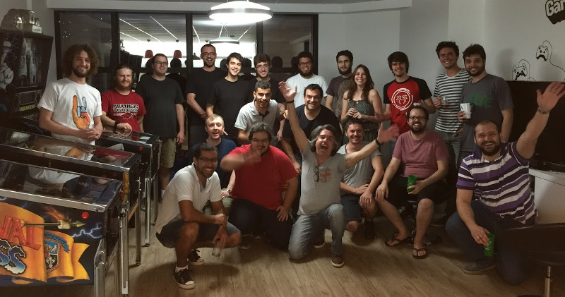

# Comunidade

Python Floripa é uma comunidade de usuários da linguagem e do ecossistema Python
na Grande Florianópolis - Santa Catarina.

Venha participar dos [nossos encontros](/encontros), nos siga nas redes sociais
ou se cadastre na lista de e-mail para saber onde e quando será o próximo.

Somos uma comunidade aberta, seguimos o [código de conduta da Associação Python
Brasil](https://github.com/pythonbrasil/codigo-de-conduta) para garantir que
todos tenham voz, e acolhemos tanto iniciantes quanto hackers do interpretador
CPython. :)

## Links úteis:

<ul>
    <li>
        <a class="" href="https://groups.google.com/forum/#!forum/python-floripa" title="Lista de Email">
            <i class="fa fa-envelope"></i> Lista de Email
        </a>
    </li>
    <li>
        <a class="" href="https://t.me/pythonfloripa" title="Telegram">
            <i class="fa fa-telegram"></i> Telegram
        </a>
    </li>
    <li>
        <a class="" href="https://twitter.com/pythonfloripa" title="Twitter">
            <i class="fa fa-twitter-square"></i> @pythonfloripa
        </a>
    </li>
    <li>
        <a class="" href="https://plus.google.com/communities/103743339273138251517" title="Google+">
            <i class="fa fa-google-plus-square"></i> Google+
        </a>
    <li>
        <a class="" href="https://www.facebook.com/groups/python.floripa/" title="Facebook">
            <i class="fa fa-facebook-square"></i> Facebook
        </a>
    </li>
    <li>
        <a class="" href="https://github.com/pythonfloripa" title="GitHub">
            <i class="fa fa-github-square"></i> GitHub
        </a>
    </li>
</ul>

